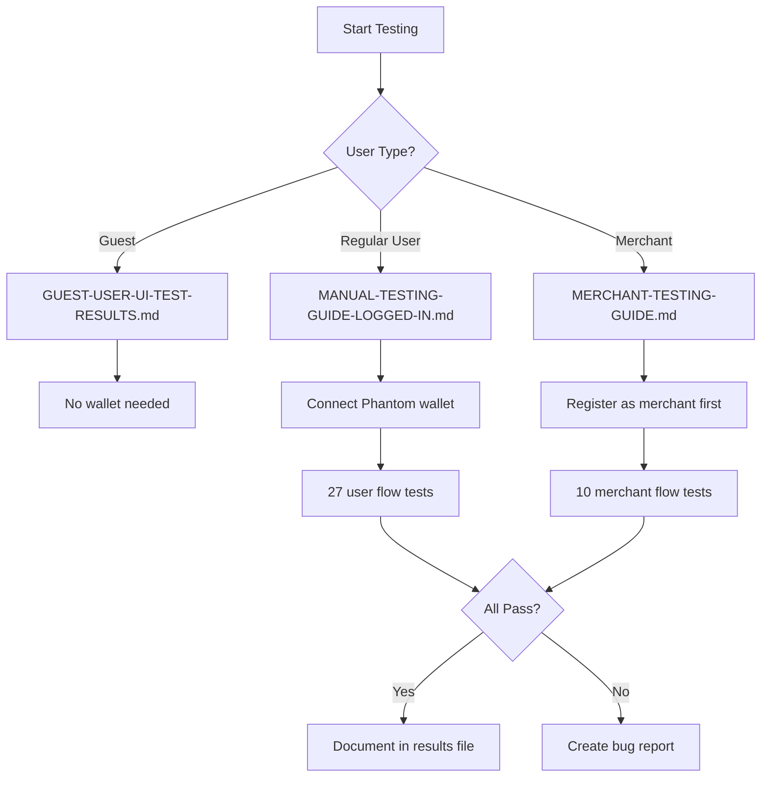

# Testing Documentation

**Last Updated:** 2025-10-19

This directory contains comprehensive testing guides and results for the NFT Coupon Platform.

---

## 📋 Testing Guide Index

### Manual Testing Guides

| Guide | User Type | Tests | Blockchain Tx | Status |
|-------|-----------|-------|---------------|--------|
| **[MANUAL-TESTING-GUIDE-LOGGED-IN.md](MANUAL-TESTING-GUIDE-LOGGED-IN.md)** | Regular User | 27 | Yes (claim, redeem, stake) | ✅ Ready |
| **[MERCHANT-TESTING-GUIDE.md](MERCHANT-TESTING-GUIDE.md)** | Merchant | 10 | Yes (mint, burn) | ✅ Ready |
| **[GUEST-USER-UI-TEST-RESULTS.md](GUEST-USER-UI-TEST-RESULTS.md)** | Guest User | 6 | No | ✅ Complete |

### Automated Testing Results

| Report | Description | Tests Run | Bugs Found |
|--------|-------------|-----------|------------|
| **[AUTOMATED-TEST-RESULTS.md](AUTOMATED-TEST-RESULTS.md)** | Playwright + Supabase MCP automated testing | 11/27 | 1 (fixed) |
| **[BUG-REPORT-2025-10-19.md](BUG-REPORT-2025-10-19.md)** | Critical voting system bug report | - | 1 (fixed) |

---

## 🧪 Quick Start

### Prerequisites
1. **Wallet**: Install Phantom or Solflare browser extension
2. **Devnet SOL**: Get free SOL from https://faucet.solana.com
3. **Dev Server**: Run `npm run dev` in `src/frontend/`

### Testing Workflow

---

## 📁 File Descriptions

### 1. MANUAL-TESTING-GUIDE-LOGGED-IN.md
**Purpose:** Comprehensive test plan for logged-in users (regular users)

**Covers:**
- Wallet connection (Solana Wallet Adapter)
- Smart contract interaction
- Deal browsing and claiming
- NFT minting (claiming deals)
- QR code generation
- Voting on deals
- Review submission
- Staking NFTs
- Cashback rewards
- Loyalty tiers and badges
- Profile management

**Requirements:**
- Phantom/Solflare wallet
- Devnet SOL for transactions
- 30-60 minutes to complete all tests

**Test Count:** 27 tests
**Blockchain Transactions:** Yes (claim, redeem, stake)

---

### 2. MERCHANT-TESTING-GUIDE.md
**Purpose:** Step-by-step testing guide for merchant-specific features

**Covers:**
- Merchant registration
- Dashboard access and navigation
- Deal creation and NFT minting
- Image uploads (Arweave/Supabase)
- Deal analytics and reporting
- QR code scanning (redemption flow)
- NFT burning (redeeming coupons)
- Merchant settings management
- Redemption history

**Requirements:**
- Completed user testing first
- Merchant registration
- Test images (JPG/PNG, <5MB)
- Devnet SOL for minting/burning
- 45-90 minutes to complete all tests

**Test Count:** 10 tests (M-01 to M-10)
**Blockchain Transactions:** Yes (mint NFTs, burn NFTs)

---

### 3. GUEST-USER-UI-TEST-RESULTS.md
**Purpose:** Test results for unauthenticated guest browsing (Groupon-like UX)

**Covers:**
- Homepage browsing
- Deal search and filtering
- Category navigation
- Deal details viewing
- Marketplace browsing
- Route protection (redirect to login when needed)

**Requirements:**
- No wallet needed
- No authentication needed
- 10-15 minutes to complete

**Test Count:** 6 tests
**Blockchain Transactions:** No

---

### 4. AUTOMATED-TEST-RESULTS.md
**Purpose:** Results from automated E2E testing using Playwright MCP + Supabase MCP

**Covers:**
- Automated UI testing results
- Wallet connection automation (auto-reconnect)
- Navigation and routing tests
- API endpoint testing
- Database verification
- Bug discoveries during automation

**Key Findings:**
- ✅ 11/27 tests automated successfully
- 🐛 1 critical bug found (voting system)
- ✅ Bug fixed during testing session
- ⚠️ 16 tests blocked (require wallet signatures)

**Test Count:** 11/27 automated
**Critical Bugs Found:** 1 (fixed)

---

### 5. BUG-REPORT-2025-10-19.md
**Purpose:** Detailed bug report for voting system database constraint violation

**Bug Details:**
- **Severity:** CRITICAL (P0)
- **Status:** ✅ FIXED
- **Found In:** Test 11 (Vote on Deals)
- **Root Cause:** Database expected 'up'/'down', frontend sent 'upvote'/'downvote'
- **Fix:** Vote type normalization layer in API route

**Impact:** 100% of vote submissions failed before fix

---

## 🎯 Testing Strategy

### Test Coverage

| Feature Category | Guest | User | Merchant | Automated |
|-----------------|-------|------|----------|-----------|
| Homepage Browsing | ✅ | ✅ | ✅ | ✅ |
| Deal Search/Filter | ✅ | ✅ | ✅ | ✅ |
| Wallet Connection | ❌ | ✅ | ✅ | ⚠️ Partial |
| Claim Deals (NFT Mint) | ❌ | ✅ | ✅ | ❌ |
| Voting | ❌ | ✅ | ✅ | ✅ |
| Reviews | ❌ | ✅ | ✅ | ❌ |
| Staking | ❌ | ✅ | N/A | ❌ |
| Merchant Dashboard | ❌ | ❌ | ✅ | ❌ |
| Deal Creation | ❌ | ❌ | ✅ | ❌ |
| QR Redemption | ❌ | ❌ | ✅ | ❌ |

**Legend:**
- ✅ Full coverage
- ⚠️ Partial coverage
- ❌ Not applicable or blocked

---

## 🐛 Known Testing Limitations

### Playwright MCP Limitations:
1. **Wallet Signatures:** Cannot programmatically approve transactions in wallet extensions
2. **Blockchain Transactions:** Minting/burning NFTs requires manual wallet approval
3. **Camera Access:** QR code scanning via camera cannot be fully automated
4. **MetaMask/Phantom Extensions:** Cannot interact with extension UI programmatically

### Workarounds:
- Use mock wallet adapter for automated blockchain testing
- Manual testing for transaction-heavy flows
- QR code manual entry for redemption testing

---

## 📊 Test Execution Summary

### Manual Tests (Total: 43 tests)
- **User Tests:** 27 (MANUAL-TESTING-GUIDE-LOGGED-IN.md)
- **Merchant Tests:** 10 (MERCHANT-TESTING-GUIDE.md)
- **Guest Tests:** 6 (GUEST-USER-UI-TEST-RESULTS.md)

### Automated Tests
- **Automated:** 11/27 user tests (41%)
- **Manual Required:** 16/27 (59%)
- **Bugs Found:** 1 critical (voting system)
- **Bugs Fixed:** 1/1 (100%)

### Pass Rate
- **Guest Tests:** 6/6 (100% pass)
- **Automated Tests:** 10/11 (91% pass, 1 bug fixed)
- **Manual Tests:** Awaiting execution

---

## 🔍 How to Use These Guides

### For QA Testers:
1. Start with **GUEST-USER-UI-TEST-RESULTS.md** (no setup needed)
2. Complete **MANUAL-TESTING-GUIDE-LOGGED-IN.md** (regular user flows)
3. Finish with **MERCHANT-TESTING-GUIDE.md** (merchant features)
4. Document any bugs found in new `BUG-REPORT-[DATE].md`

### For Developers:
1. Review **AUTOMATED-TEST-RESULTS.md** for automation scope
2. Use guides to understand user flows before implementing features
3. Reference guides when debugging issues
4. Update guides when adding new features

### For Stakeholders:
1. Review test coverage tables (above)
2. Check automated test results for regression testing
3. Review bug reports for critical issues
4. Use guides to understand platform capabilities

---

## 📝 Creating Bug Reports

**Template:** `BUG-REPORT-[YYYY-MM-DD].md`

**Required Sections:**
- Bug title and severity (P0/P1/P2)
- Steps to reproduce
- Expected vs actual behavior
- Root cause analysis
- Fix implementation
- Testing verification
- Files modified

**Example:** See [BUG-REPORT-2025-10-19.md](BUG-REPORT-2025-10-19.md)

---

## 🚀 Next Steps

### Before Production:
- [ ] Complete all 27 user tests manually
- [ ] Complete all 10 merchant tests manually
- [ ] Document results in `*-TEST-RESULTS.md` files
- [ ] Fix all P0 bugs
- [ ] Re-run automated tests on staging
- [ ] User acceptance testing (UAT)

### Future Improvements:
- [ ] Implement `@solana/wallet-adapter-mock` for blockchain testing
- [ ] Increase automated test coverage to 80%+
- [ ] Add performance testing (load testing)
- [ ] Add accessibility testing (WCAG compliance)
- [ ] Add security testing (penetration testing)

---

## 📞 Questions?

**For Testing Issues:**
- Check "Troubleshooting" sections in each guide
- Review `AUTOMATED-TEST-RESULTS.md` for similar issues
- Create new bug report if issue not documented

**For Test Updates:**
- Update guides when features change
- Keep test results current
- Document new test cases as features are added

---

**Bismillah! May these testing guides help uncover all issues before production. Tawfeeq min Allah!** 🎯
